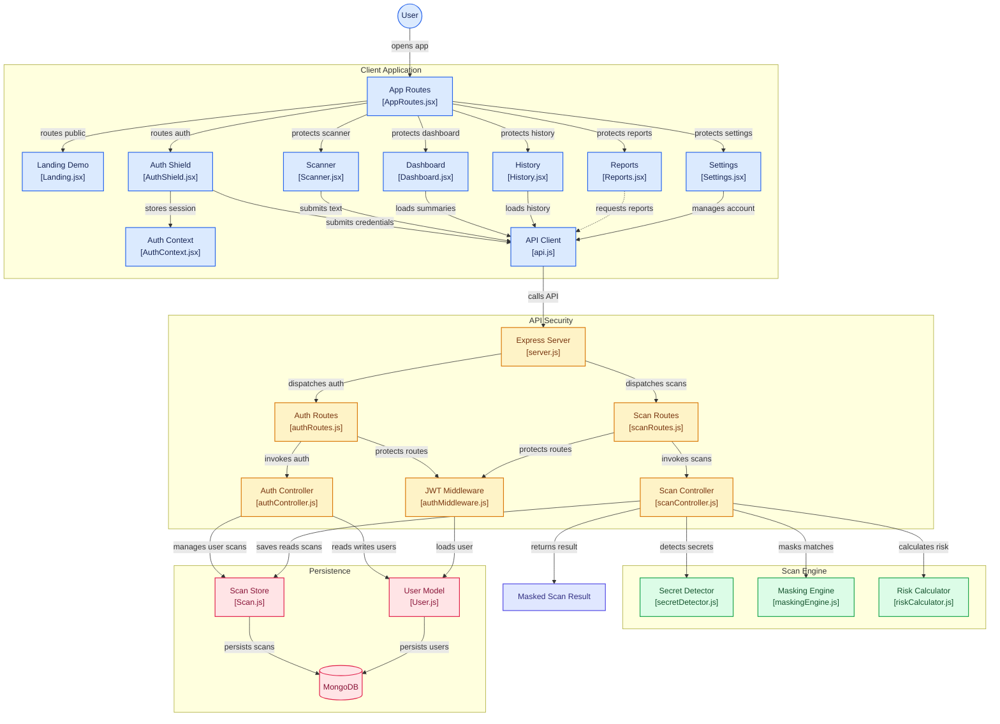

# 🛡️ PromptShield — Secure Prompt Gateway

PromptShield is a full-stack security tool that scans your code, configs, and text for sensitive secrets — API keys, passwords, tokens, database credentials, and more — before you paste them into ChatGPT, Claude, or any other AI tool. It automatically masks detected secrets with safe placeholders so your prompt stays useful without leaking anything sensitive.

## 🚨 Why I Built This

In 2023, Samsung engineers accidentally leaked confidential source code and internal meeting notes by pasting them into ChatGPT, triggering a company-wide AI ban. PromptShield was built to prevent exactly this kind of accidental leak — giving developers a safety layer between their code and any AI tool.

---

## ✨ Features

### Core Detection Engine
- **8 secret categories detected**: API Keys (OpenAI, GitHub, Slack, Stripe, SendGrid, npm, Google, Razorpay), Private Keys (RSA/EC/DSA/OpenSSH), Passwords, JWT Tokens, Database URIs (MongoDB/PostgreSQL/MySQL/Redis), AWS Keys, Emails, and Phone Numbers
- **Instant masking** — every detected secret is replaced with a readable placeholder (e.g. `[API_KEY_MASKED]`) so the text stays usable
- **Weighted risk scoring** — every scan gets a 0–100 risk score and a Low/Medium/High verdict based on the severity of what's found
- **Overlap-prevention logic** — priority-based detection ensures the same text is never double-counted across categories (e.g. a MongoDB URI won't also get flagged as a stray email)
- **Context-aware detection** — phone numbers and certain passwords require a labeling keyword (`phone:`, `password:`, etc.) to reduce false positives; email detection excludes patterns embedded inside URLs (like Sentry DSNs)

### App Features
- **Bulk file upload** — scan entire files (`.env`, `.js`, `.json`, `.py`, `.yml`, `.txt`, etc.) instead of pasting text manually
- **Scan history** — every saved scan is archived with its findings; revisit any scan to compare original vs. masked output, with a one-click copy for the safe (masked) text
- **PDF & CSV reports** — export a branded PDF report or dump your full scan history to CSV for audits
- **Safe Days Counter** — a Dashboard widget tracking how many days it's been since your last high-risk scan
- **Live landing-page demo** — try the detection engine with zero signup, entirely client-side, before creating an account

### Security & Reliability
- **Helmet.js** — sets industry-standard HTTP security headers (clickjacking protection, MIME-sniffing prevention, hidden tech stack, etc.)
- **Rate limiting** — the scan endpoint is capped at 20 requests/minute per IP to prevent abuse
- **JWT-based authentication** — all saved scans are private to the logged-in user
- **Extensively tested detection engine** — validated against 10+ real-world scenarios (payment gateways, Django/env configs, Slack/npm tokens, clean/safe code with zero false positives, edge cases like URL-embedded patterns)

---

## 🖥️ Tech Stack

**Frontend:** React, Vite, Framer Motion, Recharts, Monaco Editor, Lucide Icons, TailwindCSS
**Backend:** Node.js, Express, MongoDB Atlas (Mongoose)
**Security:** Helmet, express-rate-limit, JWT, bcrypt
**Detection:** Custom regex-based engine with priority-ordered overlap prevention

---

## 📸 Core Pages

| Page | Description |
|---|---|
| **Landing** | Public marketing page with a live, client-side detection demo |
| **Login / Signup** | JWT-authenticated access |
| **Dashboard** | Overview stats, weekly activity chart, risk distribution, Safe Days counter, recent scans |
| **Scanner** | Paste or upload text/files, scan, mask, and copy the safe output |
| **History** | Full scan archive with filtering by month, view/delete individual scans |
| **Reports** | Export PDF/CSV reports, detection breakdown chart, weekly trend |
| **Settings** | Profile management, password change, data export, account deletion |

---

## ⚙️ Setup & Installation

### Prerequisites
- Node.js (v18+)
- A MongoDB Atlas account (free tier works) — [create one here](https://www.mongodb.com/cloud/atlas/register)

### 1. Clone the repo
```bash
git clone https://github.com/<your-username>/PromptShield.git
cd PromptShield
```

### 2. Backend setup
```bash
cd backend
npm install
```

Create a `.env` file in `/backend` with:
```
MONGO_URI=your_mongodb_atlas_connection_string
JWT_SECRET=your_jwt_secret
PORT=5000
```

Run the backend:
```bash
npm run dev
```

### 3. Frontend setup
```bash
cd frontend
npm install
npm run dev
```

The app will be available at `http://localhost:5173`.

---

## 🔍 What It Detects

| Category | Examples |
|---|---|
| API Keys | OpenAI (`sk-proj-...`), GitHub (`ghp_...`), Slack (`xoxb-...`, `xoxp-...`), Stripe (`sk_live_...`), SendGrid, npm, Google (`AIza...`), Razorpay (`rzp_live_...`) |
| Private Keys | RSA / EC / DSA / OpenSSH PEM blocks |
| Passwords | Labeled password/secret assignments (`password:`, `client_secret:`, etc.) |
| JWT Tokens | Any valid `eyJ...` structured token |
| Database URIs | MongoDB, PostgreSQL, MySQL, Redis connection strings |
| AWS Keys | Access Key IDs (`AKIA...`, `ASIA...`) |
| Emails | Standard email addresses (excludes URL-embedded false positives) |
| Phone Numbers | Labeled numbers only (`phone:`, `mobile:`, `contact:`, etc.) |

> ⚠️ **Note:** This is a regex-based detection engine and, like any pattern-based scanner (including tools such as GitHub Secret Scanning), it may occasionally miss highly custom or non-standard secret formats. Always double-check masked output before sending sensitive data anywhere.

---

## 🔐 Data Privacy

- The landing-page demo runs **100% client-side** — nothing is sent to a server unless you're logged in and explicitly save a scan.
- Saved scans are stored under your JWT-protected account and are never visible to other users.
- You can delete your account and all associated data at any time from Settings.

---
## 🏗️ Architecture


## 🚀 Future Improvements

- Browser extension for real-time scanning inside ChatGPT/Claude's input box
- Entropy-based detection to catch high-randomness secrets that don't match a known pattern
- Shareable, secrets-free scan summary links
- Per-secret severity badges (Critical/High/Medium)

---

## 👩‍💻 Built By

**Kanishka** — Final-year Computer Science Engineering student, Rayat Bahra University, Chandigarh